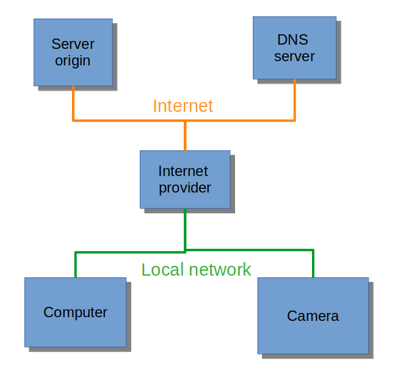

# Frontend programming class

## What you need

- Visual Studio Code
- browser

- set up Prettier extension

## Useful links

tutorials

- https://www.w3schools.com/html/default.asp
- https://developer.mozilla.org/en-US/docs/Web/HTML

flexbox

- https://css-tricks.com/snippets/css/a-guide-to-flexbox/

## Lectures

1.  Into + HTML + CSS
2.  JavaScript - basic
3.  JavaScript - web
4.  Javascript - OOP
5.  Requests
6.  Typescript + yarn
7.  Git
8.  React
9.  Automatic Tests

## How request works

