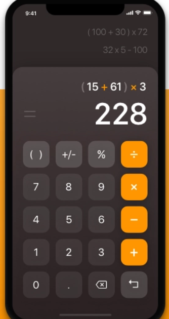

# Homework 2

-   create html and css for calculator project

    

    -   no need to iplement the mobile stuff
    -   in the center of the page will be this calculator
    -   dont implement the colorful (15+61... put there just input

-   come up with your own project, you would like to create and programm. Create wirescreen on a paper (how it should look)

-   sudoku solver

    
