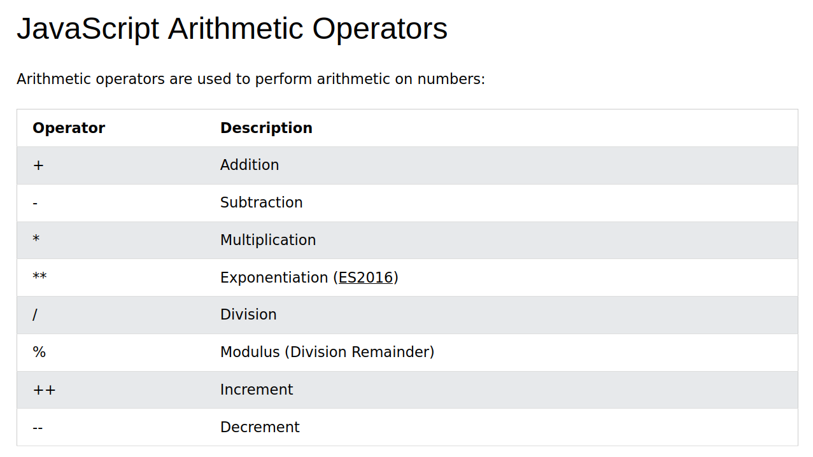
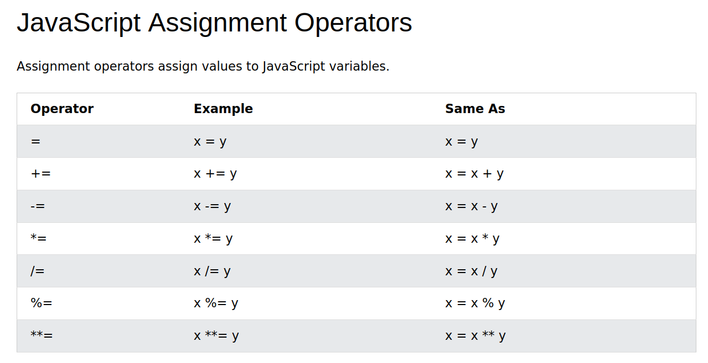
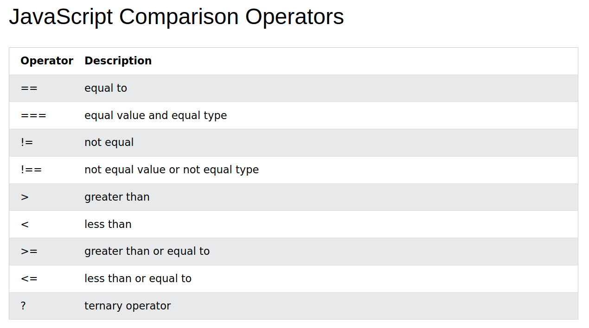
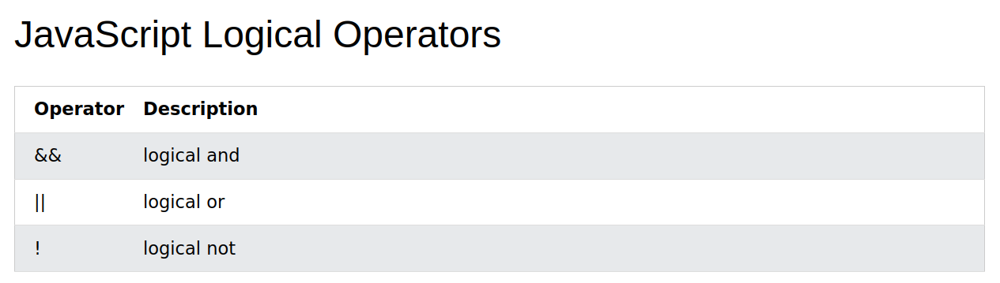

# JavaScript

can controll the page (html, css)

## Insert into html

     

or

    

comments: // or /\* ... \*/

console.log() ... log into console

## Variables

-   const
-   let
-   var (do not use it)

## Types

-   number
-   string
-   boolean
-   array
-   object
-   function (use arrow functions)
-   undefined
-   null

## Operators

## Functions

definition:

    const f = (param) => {
        return param + 5
    };

    const g = (param) => param + 5;

    // dont use this (if no need to)
    function h(param){
        return param + 5;
    }

use

    const res = f(10);

## Array

    const a = [ "ahoj", 10 ];

-   a.length ... returns length of array a
-   a[0] ... returns element on the first position

### methods

-   .map() ... creates new array of computed things
-   .push() ... add element to the end
-   .sort() ... sort array in place
-   .filter() ... return new filtered array
-   .forEach() ... go throuh all items in array
-   .join() ... join items with separator only for string[]

## Object

    const obj = {
        x: 10,
        name: "Franta",
        do: () => {}
    };

convert object to an array type

    Object.keys(obj);
    Object.values(obj);

## Useful operators

-   a ?? b ... returns a if not nullable else b
-   ...a ... decompose object or array a
-   a?.name ... if a not nulleble return a.name else return undefined

## if

    if (x > 10 || a === b) {
        // do stuff
    } else {
        // do stuff
    }

## switch

    switch(x){
        case 'Jarda':
            // do stuff
            break;
        case 'Alena':
            // do stuff
        case 'Alenka':
            // do stuff
            break;
        default:
            // do stuff
    }

## for

    for(let i = 10; i < 50; i++){
        // do stuff
    }

    const arr = ['asd', 'Pepa', 'Franta'];
    for(let i in arr){
        const name = arr[i];
        // ....
    }

    for(let name of arr){
        // ....
    }

you can use:

-   break;
-   continue;

## while

    while (x > 50) {
        // do stuff
    }

## setTimeout, setInterval

handles code after some while

-   setTimeout ... do it once
-   setInterval ... do it repetetivly

needs to be cleaned (destroyed) via

-   clearTimeout()
-   clearInterval()

## Try catch

in code can be some thrown errors (like devision by 0 or reading atribute of undefined) or you can throw error

    throw new Error('msg');

u can catch them via try catch block

    try {
        // here can be thrown some error
    } catch (e) {
        // some error e was thrown
    } finally {
        // do everytime
    }

## Promise, async, await

used for asynchronous code !!! it runs synchronously in background. You can create Promise that will run code asynchronly

    const promise = new Promise((resolve, reject) => {
        setTimeout(resolve, 1000);
    });

    const f = async () => {
        //do stuff, you can use await
        await someAsyncFunc();
    }

if you can use async/await instead of Promise

you can set what shloud be done after promise ends

    promise.then((res) => ... );

or catch errors

    promise.catch((e) => ... );

## Classes

Define how object looks

    class Animal {
        name = "Pepa";

        constructor(name) {
            this.name = name;
        }
    }

    const animal = new Animal('Eva');

you can extend object

    class Dog extends Animal {
        constructor(name) {
            super(name);
        }

        bark() {
            console.log('haf');
        }
    }

    const dog = new Dog('Alik');
    dog.bark();

## Best Practice

https://www.w3schools.com/js/js_best_practices.asp
